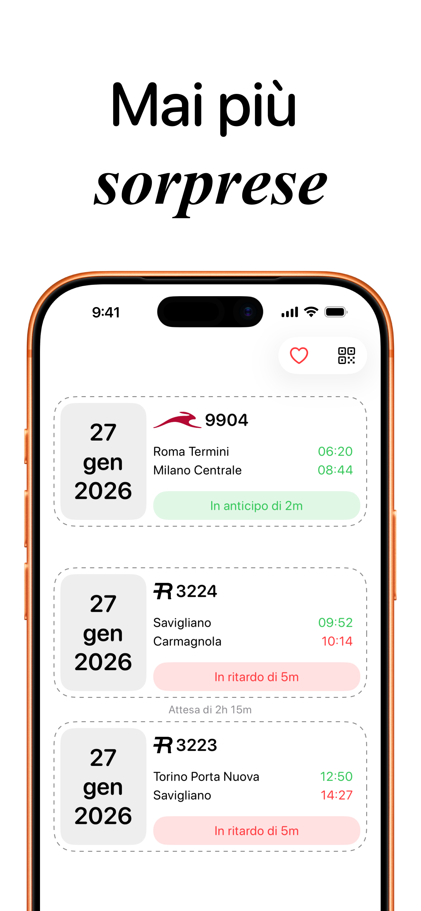
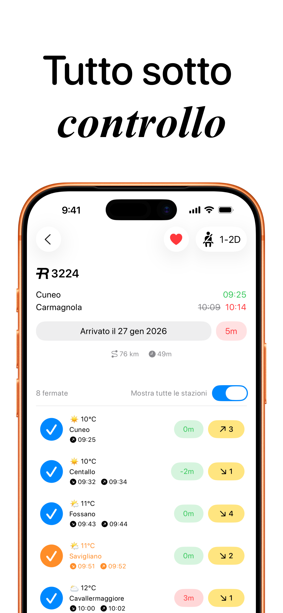
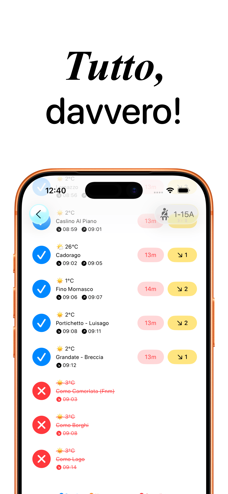
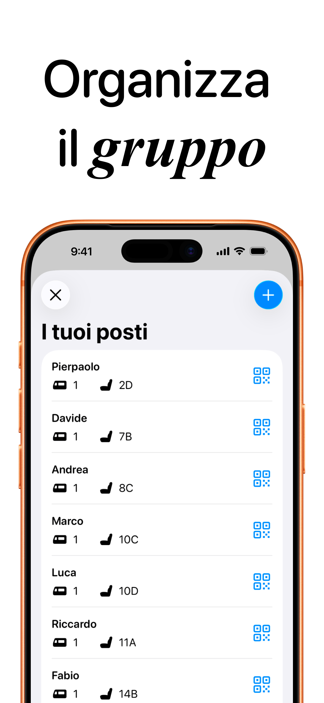

# Rail - Il tuo viaggio, semplificato.

**Rail** è l'applicazione definitiva per il pendolare moderno. Nata dall'esigenza di avere informazioni chiare e precise, Rail unisce il monitoraggio dei treni in tempo reale con funzionalità social uniche per i viaggi di gruppo, il tutto racchiuso in un design nativo ed essenziale.

---

## 📱 Screenshots

  
  
  
  

---

## ✨ Funzionalità Chiave

* **Monitoraggio Live:** Tracking in tempo reale di orari, ritardi, binari e cancellazioni.
* **Gestione Gruppi ("I tuoi Posti"):** Un sistema intuitivo per assegnare e visualizzare le carrozze e i posti a sedere di tutti i compagni di viaggio.
* **Contesto Intelligente:** Integrazione con servizi meteo per visualizzare le condizioni atmosferiche previste ad ogni singola fermata intermedia.
* **UI Nativa e Fluida:** Interfaccia sviluppata interamente in SwiftUI seguendo le Human Interface Guidelines di Apple.

---

## 🛠 Tech Stack & Architettura

Il progetto è stato sviluppato con un approccio moderno, privilegiando la pulizia del codice e le performance.

* **Linguaggio:** Swift 6.2 (con supporto a concorrenza Swift 6)
* **UI Framework:** SwiftUI
* **Architettura:** MVVM (Model-View-ViewModel) per una chiara separazione delle responsabilità.
* **Concurrency:** Async/Await per la gestione delle chiamate di rete asincrone.
* **Networking:** URLSession nativo (nessuna dipendenza esterna pesante) con gestione custom degli errori API.
* **Persistenza Dati:** FileManager/UserDefaults per il salvataggio locale sicuro delle configurazioni dei gruppi.
* **Servizi:** CoreLocation per la geolocalizzazione e il fetch dei dati meteo contestuali.

### Sfide Tecniche Risolte
* **Parsing Complesso:** Gestione e normalizzazione di dati ferroviari spesso frammentati o incompleti provenienti da API legacy.
* **Stati UI Dinamici:** Gestione fluida degli stati di caricamento, errore e "empty state" (scheletri di caricamento) per migliorare la percezione di velocità dell'app.
* **Privacy First:** Architettura progettata per processare i dati sensibili (nomi, posizioni) esclusivamente on-device.

---

## 📄 Licenza

Questo progetto è distribuito sotto licenza **GNU GPLv3**.
Sei libero di studiare, modificare e utilizzare il codice, ma qualsiasi lavoro derivato distribuito deve rimanere open source sotto la stessa licenza. Vedi il file `LICENSE` per maggiori dettagli.

---

## 📬 Contatti

Sei un recruiter o uno sviluppatore interessato al progetto?
Sarei felice di discutere le scelte architetturali o ricevere feedback sul codice.

🌐 **Website:** [francescoparadiso.com](https://www.francescoparadiso.com)

---

## 🚀 Download

Scarica Rail direttamente dall'App Store e inizia a viaggiare meglio.

