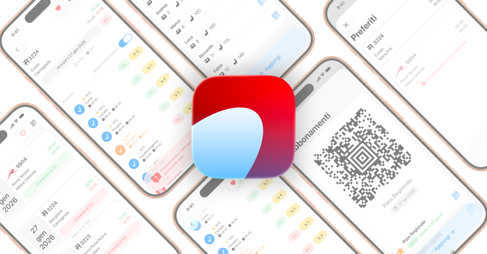
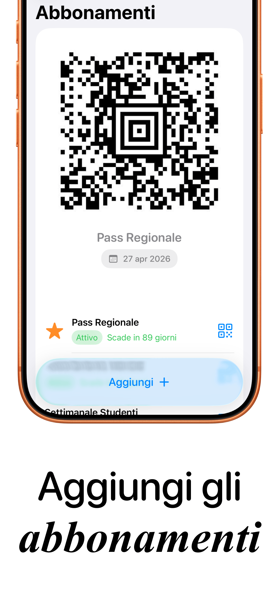
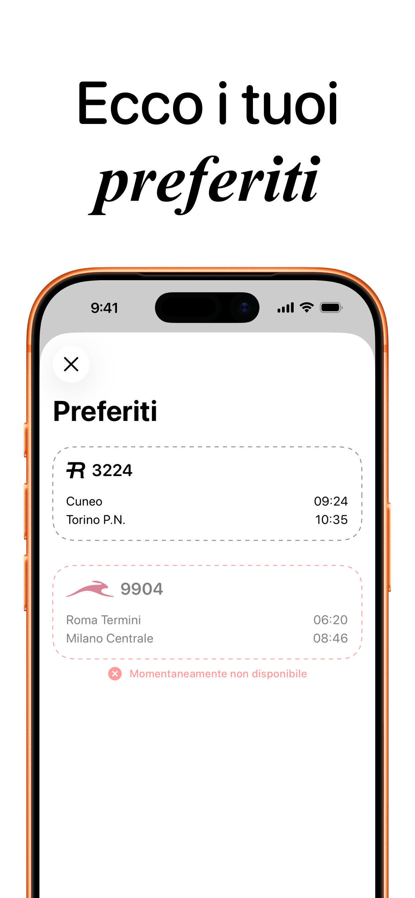

# Rail - Il tuo viaggio, semplificato.

**Rail** è l'applicazione definitiva per il pendolare moderno. Sviluppata interamente in **SwiftUI**, Rail elimina la complessità del viaggio unendo il monitoraggio dei treni in tempo reale con una gestione avanzata dei titoli di viaggio e dei posti a sedere, il tutto in un design nativo ed essenziale.

## 📱 Screenshots

  
  
  
  
  
  
  

## ✨ Nuove Funzionalità & Aggiornamenti

* **Gestione Abbonamenti (Pass):** Sistema integrato per digitalizzare abbonamenti settimanali, mensili o annuali.
* **Scanner Intelligente:** Sfrutta il framework Vision per estrarre i QR code direttamente dalle immagini della galleria e monitorare i giorni rimanenti alla scadenza.
* **Widget "Liquid Glass":** Nuovi widget per la Home Screen con design in vetro smerigliato per mostrare lo stato dell'abbonamento o del prossimo viaggio a colpo d'occhio.
* **Treni Preferiti:** Salvataggio delle tratte frequenti per aggiungere i viaggi alla propria routine con un solo tocco, senza inserire manualmente il numero del treno.
* **Monitoraggio Live:** Tracking in tempo reale di orari, ritardi, binari e cancellazioni con calcolo dinamico dei tempi effettivi.
* **Gestione Gruppi ("I tuoi Posti"):** Organizzazione e visualizzazione delle carrozze e dei posti a sedere per tutti i compagni di viaggio.
* **Contesto Meteorologico:** Integrazione con servizi meteo per visualizzare le condizioni atmosferiche previste ad ogni singola fermata del tragitto.

## 🛠 Tech Stack & Architettura

Il progetto adotta un approccio pragmatico che combina le più recenti API Apple con una solida gestione asincrona dei dati.

* **Linguaggio:** Swift 6.2
* **UI Framework:** SwiftUI
* **Persistenza Dati:** **SwiftData** per una gestione moderna e performante del database locale (Treni, Stop, Sedili, Favoriti e Pass).
* **Architettura:** MVVM (Model-View-ViewModel).
* **Concurrency:** Adozione di **Async/Await** per l'integrazione asincrona e **Grand Central Dispatch (DispatchGroup)** per la sincronizzazione di provider multipli (Italo/Trenitalia).
* **Vision Framework:** Utilizzato per la scansione automatica e l'estrazione di dati dai QR code dei biglietti digitali.

### Sfide Tecniche Risolte
* **Normalizzazione Multi-Provider:** Layer di astrazione che unifica le risposte JSON eterogenee di provider differenti in un unico modello dati coerente.
* **Widget Integration:** Implementazione di widget trasparenti tramite `WidgetKit` per visualizzare informazioni critiche in tempo reale.
* **Algoritmi Custom:** Sviluppo di logiche per la normalizzazione dei binari e il calcolo delle distanze geospaziali tra le stazioni.

## 📄 Licenza

Questo progetto è distribuito sotto licenza **GNU GPLv3**. Sei libero di studiare, modificare e utilizzare il codice, ma qualsiasi lavoro derivato deve rimanere open source sotto la stessa licenza. Vedi il file `LICENSE` per maggiori dettagli.

## 📬 Contatti

Sviluppato con passione da **Francesco Pio Paradiso**, studente di Magistrale in ICT (AI, ML & Big Data) presso il Politecnico di Torino.

🌐 **Website:** [francescoparadiso.com](https://www.francescoparadiso.com)

🔗 **LinkedIn:** [Francesco Pio Paradiso](https://www.linkedin.com/in/francescopioparadiso)

## 🚀 Download

Scarica Rail direttamente dall'App Store e inizia a viaggiare meglio.

